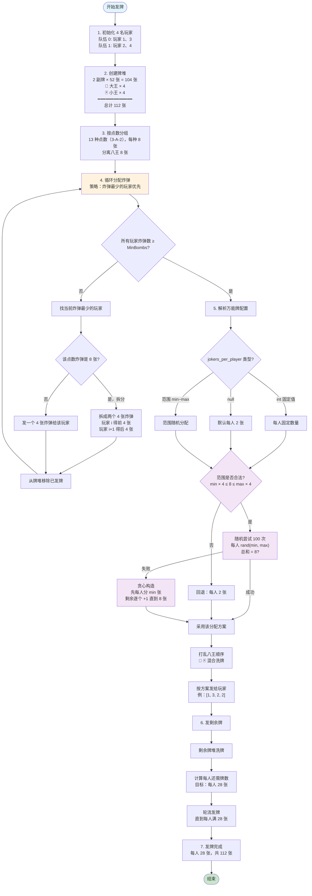

# 双扣 - 八王千变 发牌流程

## Mermaid 流程图

---

## 流程说明

### 1. 牌堆组成
| 类型 | 数量 | 说明 |
|------|------|------|
| 普通牌 | 104 张 | 2 副牌 × 52 张（13 点数 × 4 花色） |
| 大王 👑 | 4 张 | 万能牌/癞子 |
| 小王 🃏 | 4 张 | 万能牌/癞子 |
| **总计** | **112 张** | 4 人 × 28 张 |

### 2. 炸弹分配策略
**目标**：每人至少 `MinBombs` 个炸弹

**规则**：
- 遍历 13 种点数（从小到大：3 → 4 → ... → A → 2）
- 每次找当前炸弹最少的玩家
- 分配方式：
  - **8 张炸弹**：拆成两个 4 张，分给相邻两个玩家
  - **4 张炸弹**：直接给一个玩家
- 当所有玩家炸弹数都 ≥ MinBombs 时停止

### 3. 八王分配策略（核心改动）

**配置项**：`jokers_per_player`

| 配置类型 | 示例 | 说明 |
|----------|------|------|
| 固定值 | `2` | 每人固定 2 张 |
| 范围 | `[0, 4]` | 每人 0~4 张，总和=8 |
| 默认 | `null` | 每人 2 张 |

**范围分配逻辑**：
1. **合法性检查**：`min × 4 ≤ 8 ≤ max × 4`
   - 不合法 → 回退到每人 2 张
2. **随机尝试**：100 次随机分配
   - 每人随机 `randint(min, max)`
   - 总和 = 8 → 成功
3. **贪心构造**（随机失败时）：
   - 先每人分 min 张
   - 剩余牌逐个 +1 直到 8 张

**示例**（范围 [0, 4]）：
- 可能结果：`[1, 3, 2, 2]`、`[0, 4, 2, 2]`、`[4, 0, 1, 3]` 等

### 4. 剩余牌分配
- 剩余牌堆洗牌
- 计算每人还需牌数（目标 28 张）
- 轮流发牌直到每人满 28 张

### 5. 最终结果
每人 28 张牌，包含：
- 至少 MinBombs 个炸弹
- 0~4 张万能牌（取决于配置）
- 其余普通牌
