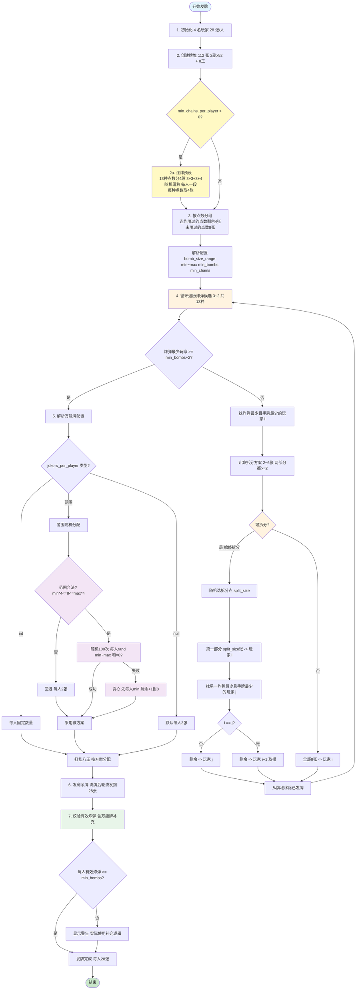

# 双扣 - 八王千变 发牌流程

## Mermaid 流程图



---

## 流程说明

### 1. 牌堆组成
| 类型 | 数量 | 说明 |
|------|------|------|
| 普通牌 | 104 张 | 2 副牌 x 52 张（13 点数 x 4 花色） |
| 大王 | 4 张 | 万能牌/癞子 |
| 小王 | 4 张 | 万能牌/癞子 |
| **总计** | **112 张** | 4 人 x 28 张 |

### 2. 连炸预设（新增，步骤 2a）

**触发条件**: `min_chains_per_player > 0`（默认 0 跳过）

**分配逻辑**:
1. 13种点数（3~A, 2）分成 4 个连续段：3+3+3+4=13
2. 段大小随机打乱，起始位置随机偏移（循环排列）
3. 每人一段，每段内点数相连形成连炸（3~4连环）
4. 每种点数取 4 张给玩家，剩余 4 张留在牌堆供普通炸弹使用

**示例**:
```
偏移量 11，段大小 [4,3,3,3]
玩家1: [A-2-3-4] 4连环（16张）
玩家2: [5-6-7]   3连环（12张）
玩家3: [8-9-10]  3连环（12张）
玩家4: [J-Q-K]   3连环（12张）
剩余牌: 52张（含各点数剩余4张 + 8张王）
```

### 3. 炸弹分配策略（核心逻辑）

**配置项**: `bomb_size_range` 默认 [4, 4]，当前配置 [4, 6]

**循环规则**:
- 遍历 13 种点数（3 -> 4 -> ... -> A -> 2）
- 找当前炸弹数最少且手牌最少的玩家 i
- **终止条件**: 当最少玩家的炸弹数 >= min_bombs + 2 时停止

**拆分逻辑**（始终拆分，增加多样性）:
| 步骤 | 说明 |
|------|------|
| 1. 计算拆分方案 | 拆分点范围 2~6，确保两部分都 >= 2 张 |
| 2. 随机选拆分点 | `split_size = random.choice(possible_splits)` |
| 3. 第一部分 -> 玩家 i | 当前炸弹最少且手牌最少的玩家 |
| 4. 剩余部分 -> 玩家 j | 另一个炸弹最少且手牌最少的玩家（若 i==j 则取 i+1） |

**拆分效果**（1000 局统计）:
| 炸弹大小 | 占比 |
|---------|------|
| 4 张 | ~57% |
| 5 张 | ~22% |
| 6 张 | ~21% |

### 4. 八王分配策略

**配置项**: `jokers_per_player` 当前配置 [0, 4]

| 配置类型 | 示例 | 说明 |
|----------|------|------|
| 固定值 | `2` | 每人固定 2 张 |
| 范围 | `[0, 4]` | 每人 0~4 张，总和=8 |
| 默认 | `null` | 每人 2 张 |

**范围分配逻辑**:
1. **合法性检查**: min x 4 <= 8 <= max x 4，不合法则回退到每人 2 张
2. **随机尝试**: 100 次随机分配，每人 rand(min, max)，总和=8 即成功
3. **贪心构造**（随机失败时）: 先每人分 min 张，剩余逐个 +1 直到 8 张

### 5. 有效炸弹校验

**新增校验逻辑**（含万能牌补充）:
- 统计每个玩家手牌中同点数牌的数量
- **有效炸弹判定**: 同点数牌 + 万能牌 >= 4 张，算 1 个炸弹
- 例: 玩家有 3 张 K + 1 张小王 = 1 个有效炸弹

**校验结果**:
- 每人有效炸弹 >= min_bombs -> 发牌成功
- 不足 -> 显示警告，但继续发牌（由外层重试机制处理）

### 6. 剩余牌分配
- 剩余牌堆洗牌
- 计算每人还需牌数（目标 28 张）
- 轮流发牌直到每人满 28 张

### 7. 最终结果
每人 28 张牌，包含:
- 0~1 组连炸（取决于 min_chains_per_player）
- 至少 min_bombs 个炸弹（可含万能牌补充）
- 0~4 张万能牌（取决于配置）
- 其余普通牌
